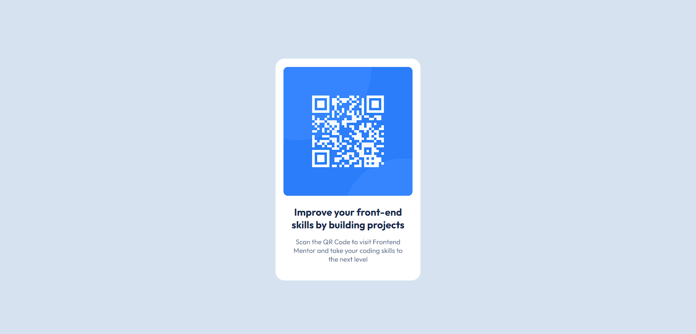

# Frontend Mentor - QR code component solution

This is a solution to the [QR code component challenge on Frontend Mentor](https://www.frontendmentor.io/challenges/qr-code-component-iux_sIO_H). Frontend Mentor challenges help you improve your coding skills by building realistic projects. 

## Table of contents

  - [Screenshot](#screenshot)
  - [Links](#links)
  - [Built with](#built-with)
- [Author](#author)

### Screenshot

### Links

- Solution URL: https://github.com/official-harshitjuneja/QR-Code-Component
- Live Site URL: https://official-harshitjuneja.github.io/QR-Code-Component/

### Built with

- Semantic HTML5 markup
- CSS custom properties
- Flexbox
- CSS Grid
- Mobile-first workflow

## Author

- Frontend Mentor - [@official-harshitjuneja](https://www.frontendmentor.io/profile/official-harshitjuneja)
- Linkedin - [@harshit-juneja](https://linkedin.com/in/harshit-juneja)
